# BearPi-HM Nano 十分钟上手教程<a name="ZH-CN_TOPIC_0000001054781998"></a>

## 一、准备工作<a name="section466851916410"></a>
- 准备一台电脑：
    - 无具体要求，家用即可，Windows系统

## 二、开始下载
- 下载官方提供镜像：
    - 下载地址（百度云）：https://pan.baidu.com/s/1T0Tcl3y48C1p5L6y-6HJNg  提取码：eusr

- 下载虚拟机VMware Workstation：
    - VMware Workstation 12：版本12及以上，具体可以百度。

- 下载MobaXterm工具
    - 无具体要求，具体下载可以百度。

- 下载RaiDrive工具
    - https://forspeed.rbread05.cn/down/newdown/5/28/RaiDrive.rar   

## 三、开始部署环境

1. 解压百度云下载的鸿蒙`Ubuntu18.4镜像OVF.zip`文件到某个目录。

    

2. 打开VMware Workstation工具

    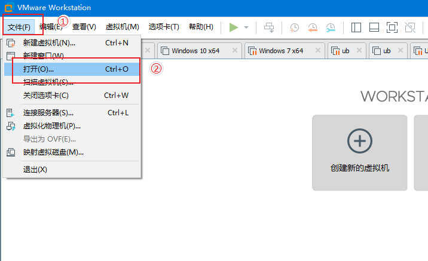

3. 选择第1步解压的`Ubuntu18.4镜像OVF`文件夹中，点击` 打开 `

    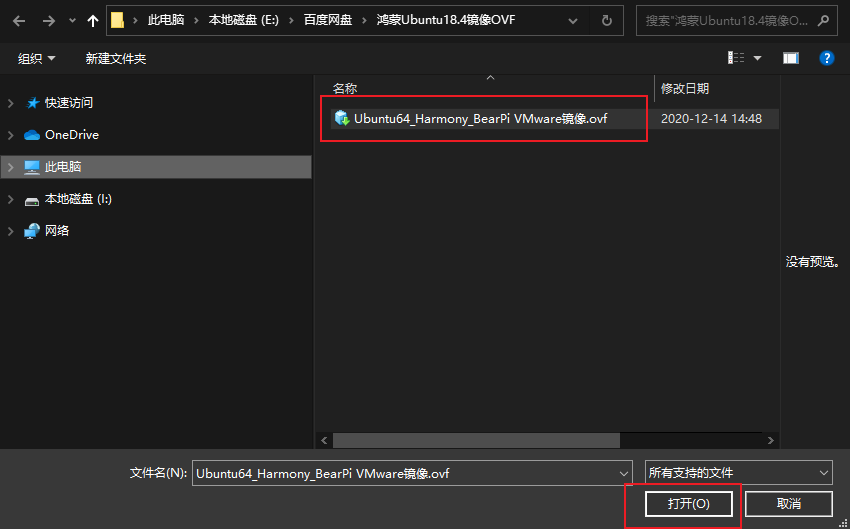

4. 导入镜像到本地磁盘（选择一个磁盘空间大小≥ 10G的盘），点击`导入`。

    

5. 点击`开启此虚拟机`，来开启虚拟机电源
 
    
    
6. 此时虚拟机进入登录界面，点击`HarmonyOS`

    

7. 输入密码：bearpi，然后点击`登录`

    

8. 进入桌面后，点击桌面空白处`右键`，点击`打开终端(E)`

    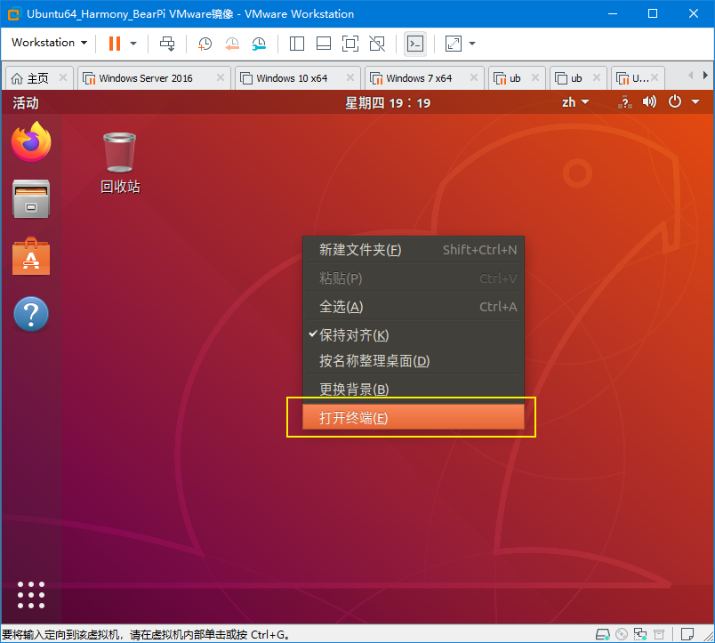

9. 在终端中输入`ifconfig`，然后点击回车，除`lo`外，另外一个就是你的网卡信息，记录你获取到的IP地址。

    

10. 最小化VMware Workstation，回到Windows桌面上。

11. 附加：如果连不上网络（如果主机网络需要拨号，如`校园网络`、`ADSL拨号`等）

    在VMware Workstation中，点击`虚拟机`>> `设置`

    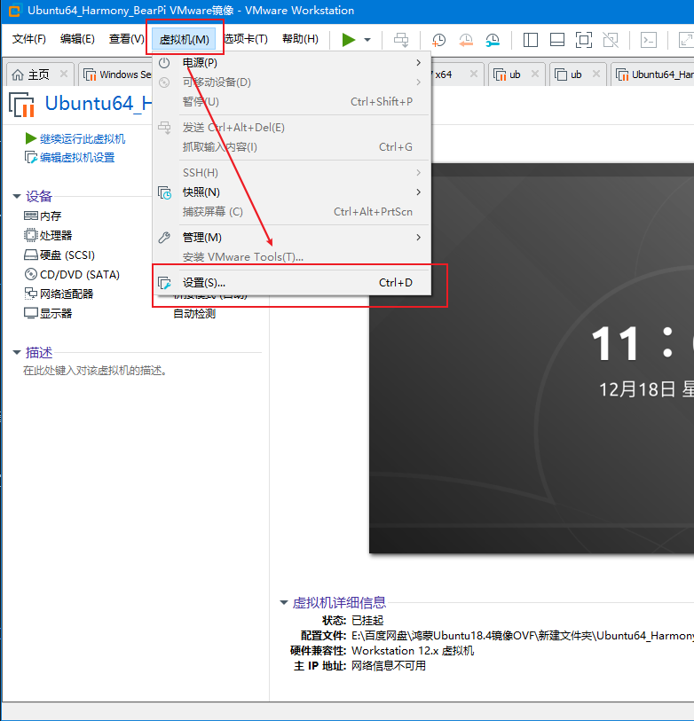

    然后在网络适配器中，改成`NET 模式`，点击`确定`

    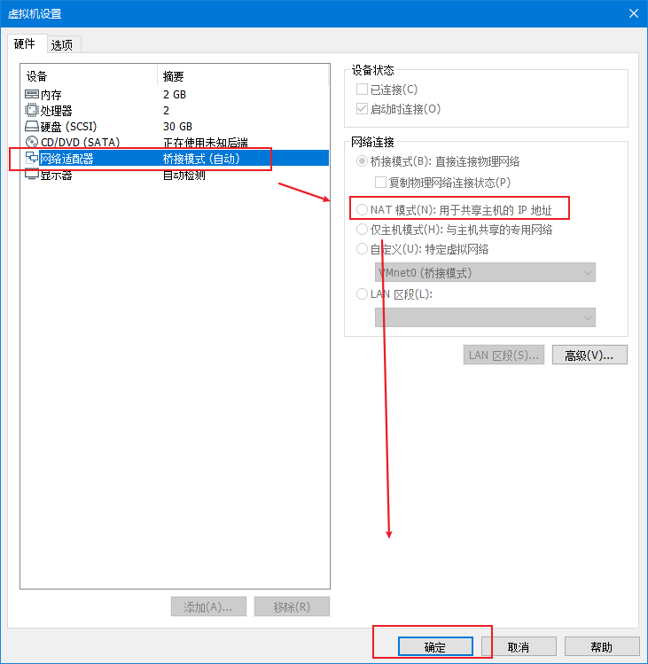

    然后再回复`步骤8`。

    

## 四、在Windows上远程连接服务器

1. 打开`MobaXterm`工具，并依次点击：`Session`，`SSH` 按钮。

    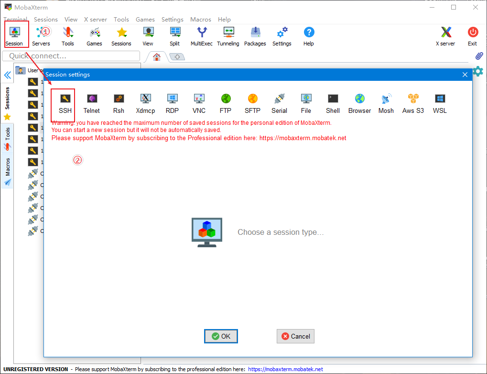

2. 输入连接信息，远程地址，并点击OK

    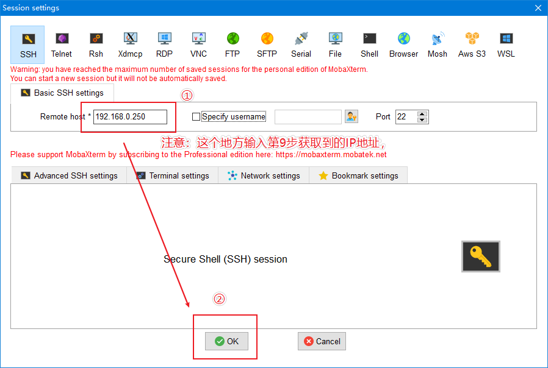

3. 输入账号：`bearpi`，点击回车

    

4. 输入密码：`bearpi`，注意，输入密码的时候屏幕不会显示，输完之后点击`回车`

    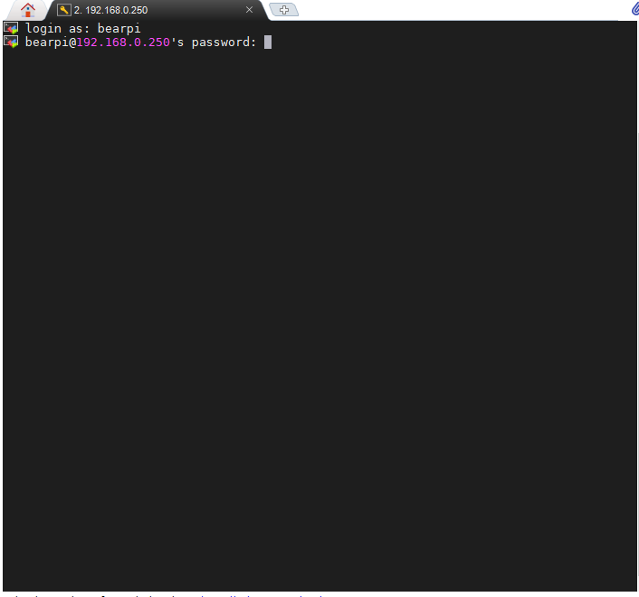

5. 在弹出的界面上，点击`Yes`保存账号信息，以免下次输入

    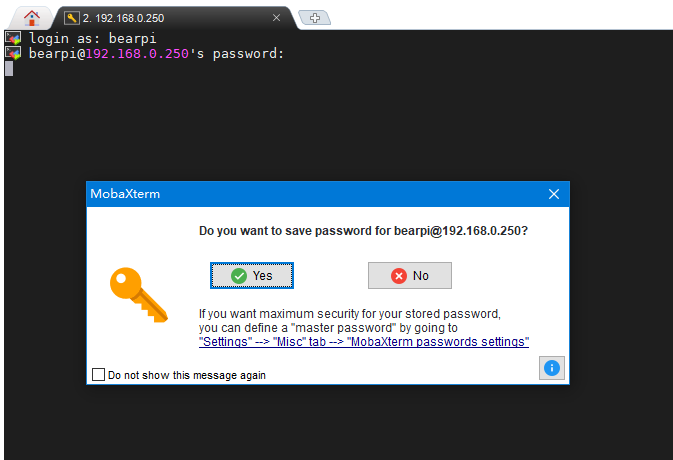

## 五、把ubuntu文件远程映射到Windows上

1. 安装RaiDrive软件
    
    默认安装即可。

2. 切换为中文语言

    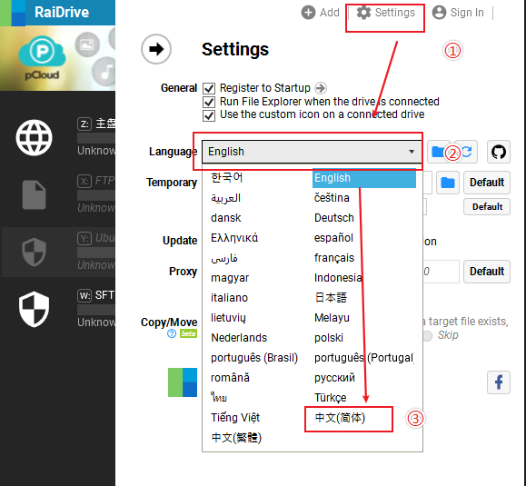

3. 添加链接信息

    * SFTP://______ （这个输入 四.9 获取到的地址
    * 账户：账号和密码皆为 bearpi   
    * 其他默认
    * 点击`确定`

    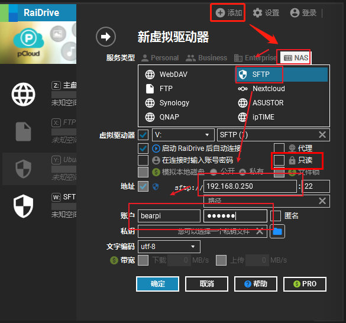

4. 查看本地映射的ubuntu文件路径

    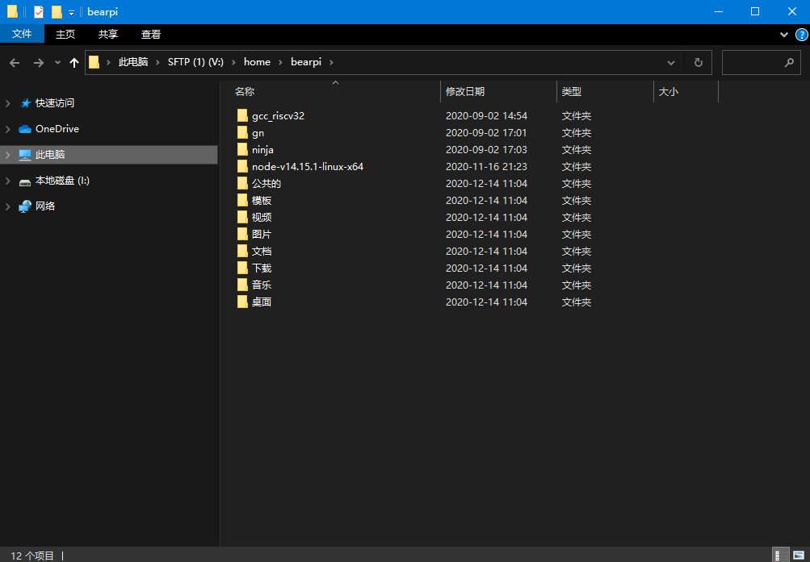


## 六，在ubuntu获取源码

1. 鼠标焦点已到MobaXterm

2. 在MobaXterm中输入：
    ```
    cd /home/bearpi
    ```
    然后回车

3. 在MobaXterm中输入： 
    ```
    mkdir project && cd project
    ```
    然后回车

4. 在MobaXterm中输入：
    ```
    hpm init -t default
    ```
    然后回车

5.  在MobaXterm中输入：

    ```
    hpm i @bearpi/bearpi_hm_nano
    ```
    然后回车，等待1-3分钟（根据不同网速）

6. 当屏幕中出现`Installed.`意味着代码获取完成


## 七、编译代码

1. 在MobaXterm中输入：
    ```
    hpm dist
    ```
    然后回车，等待直到屏幕出现：`BUILD SUCCESS`字样，说明编译成功。

2. 查看编译出的固件位置

    当编译完后，在Windows中可以直接查看到最终编译的固件，具体路径在：

    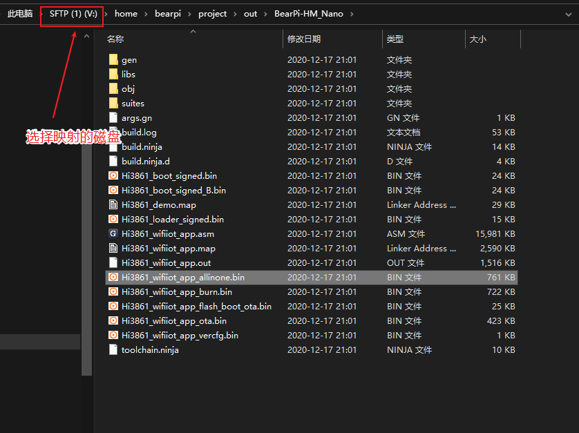

    *注意，最前的磁盘在为`RaiDrive`映射的路径。

## 八，连接开发板

1. 通过TypeC数据线，把电脑与BearPi-HM Nano链接。

2. 安装CH340驱动。

3. 关闭虚拟机捕获USB功能。（有很多开发者都是因为虚拟机捕获了USB设备，导致本机Windows电脑看不到串口）

    

    如果上面操作不行，直接关闭VMware Workstation，选择挂起，然后再重新插拔USB。

4. 查看开发板的串口

    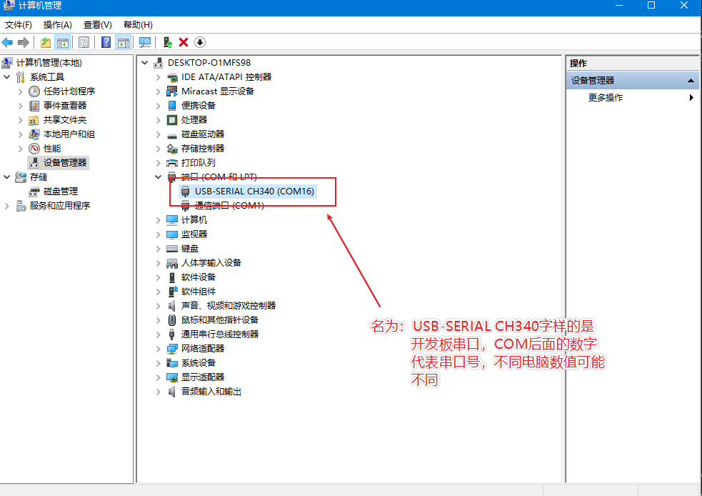

## 九，下载程序

1. 在Windows打开Hiburn工具，并点击`Refresh`，在`COM`中选择`第八-4`看到的COM号

    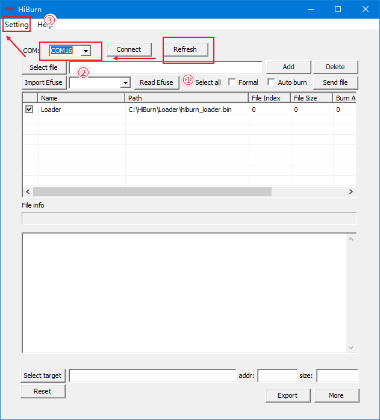

    然后点击`Setting`，并选择 `Com settings`，

2. 在Com settings中设置`Baud`为：`921600`，点击确定    

    

3. 点击 Hiburn工具中的`Select file`按钮，在弹出的文件框中，选择`七-2` 中对应的路径，并选中：`Hi3861_wifiiot_app_allinone.bin` 文件。

    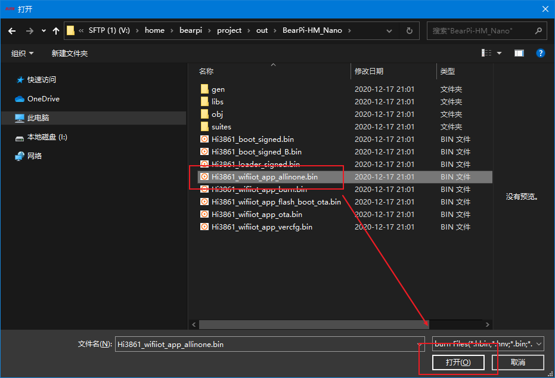

4. 点击`Auto burn`复选框，然后点击`Connect`

    

    此时`Connect`按钮变成`Disconnect`，等待下载

5. 复位开发板`RESET`按键，开始下载程序

    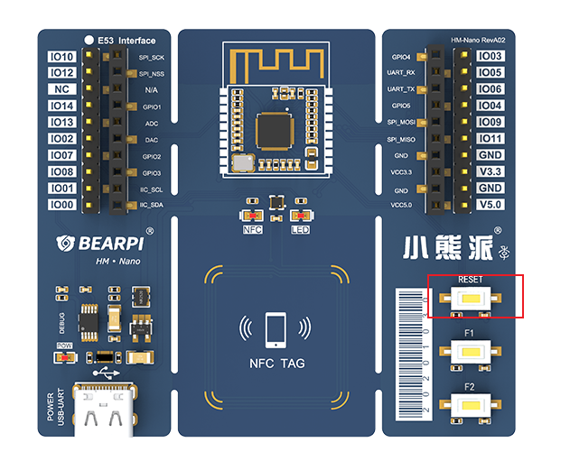

    

    
6. 直到出现`Execution Successful`字样，程序下载完成。

7. 下载完后，点击`Disconnect`按钮，便于后面调测使用。


## 十，MobaXterm 查看串口打印日志

1. 打开MobaXterm，
    
    1. 点击：`Session`、`Serial`按钮

    2. 设置Seral port为 Hiburn 同一个串口

    3. 设置Speed为 `115200`

    4. 点击`OK`


    

2.  如果显示Unable to open...等字样，需要看一下Hiburn的链接状态是否为关闭（九-7）步骤。


3. 复位开发板，此时COM打印出对应日志信心

    


